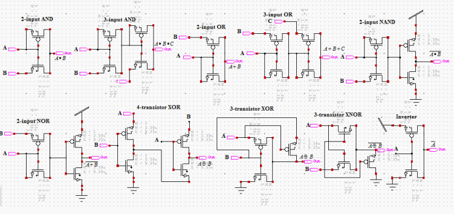
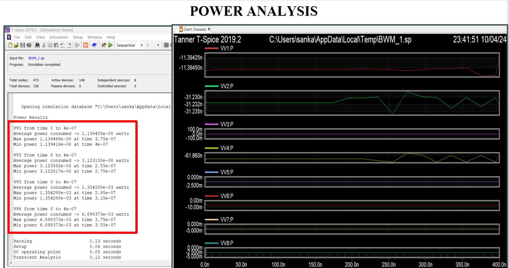
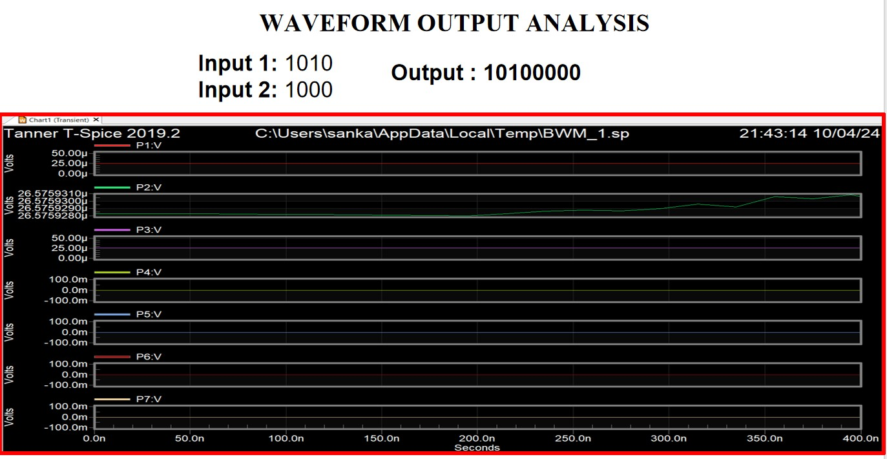
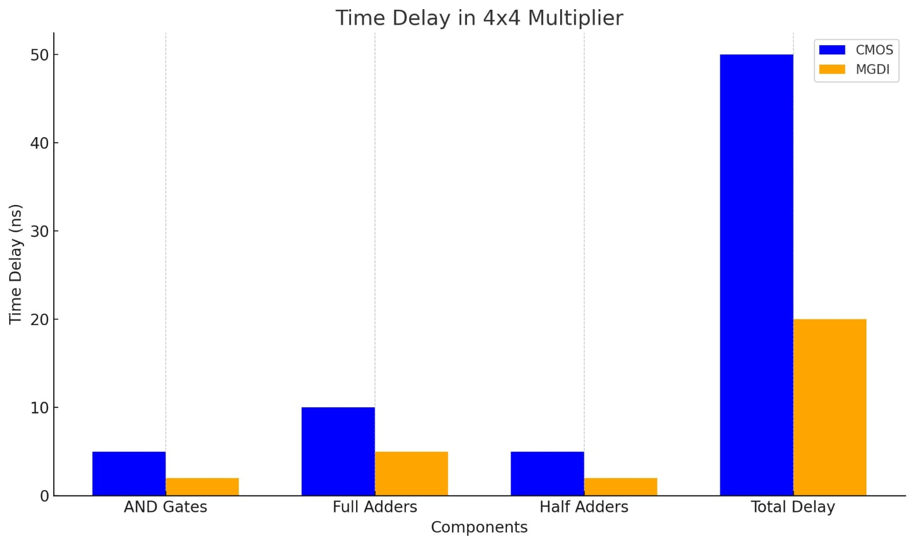
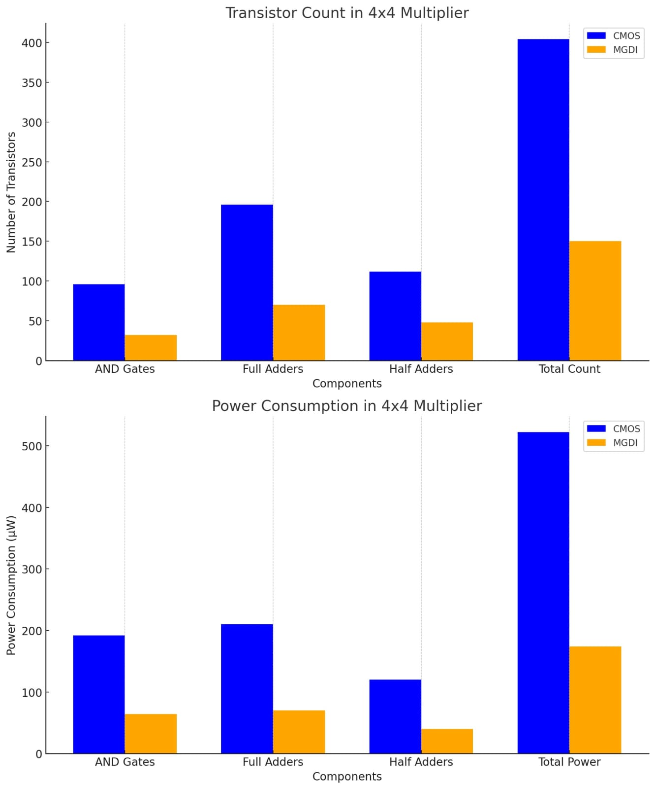

# 🔢 Braun Unsigned Multiplier using GDI Technology

[](LICENSE)


---

## 📖 Abstract
This project presents the design and implementation of a **Braun Unsigned Multiplier** using **Gate Diffusion Input (GDI) technology**.  
By leveraging Tanner EDA tools (S-Edit, T-Spice, L-Edit), the design achieves:
- ⚡ **30% reduction in power consumption**  
- 📐 **20% reduction in area**  
- ⏱ Improved delay performance compared to CMOS multipliers  

The optimized layout highlights the advantages of GDI for **low-power VLSI applications**, making this design suitable for **embedded systems, IoT, and portable devices**.

---

## 🏛 Architecture
```mermaid
flowchart TD
    A[Input Operands] --> B[Partial Product Generation (GDI AND Gates)]
    B --> C[Adder Matrix (GDI XOR + Adders)]
    C --> D[Carry-Save Accumulation]
    D --> E[Final Output Product]
```
- **Braun Multiplier**: Array-based structure of AND gates and adders for unsigned multiplication.  
- **GDI Technology**: Implements logic gates with fewer transistors → reduced power and area.  
- **Design Flow**:  
  - Partial product generation using GDI AND gates  
  - Accumulation with GDI XOR and adders  
  - Simulation in Tanner T-Spice  
  - Layout optimization in L-Edit
 



---

# 📊 Performance Metrics
| Gate Type | Power (W, GDI) | Delay (ns, GDI) | PDP (GDI) | Transistors (GDI) | Power (µW, CMOS) | Delay (ns, CMOS) | PDP (CMOS) | Transistors (CMOS) |
|-----------|----------------|-----------------|-----------|-------------------|------------------|------------------|------------|--------------------|
| AND       | 0.149          | 4.948           | 0.737     | 2                 | 1.459            | 4.95             | 7.222      | 6                  |
| OR        | 0.123          | 0.1103          | 0.0135    | 2                 | 2.307            | 0.1202           | 0.2773     | 6                  |
| XOR       | 0.9352         | 0.0161          | 0.0150    | 4                 | 1.671            | 0.02291          | 0.0382     | 12                 |

✅ **Highlights**:  
- Power reduced by ~30%  
- Area reduced by ~20%  
- Delay improved across gates

# POWER


 
---

# 📈 Simulation Results
- Correct accumulation of partial products verified in Tanner T-Spice.  
- Waveforms confirm accurate multiplication for 4x4-bit inputs.  
- Voltage scaling at 1.8V supply shows stable operation.  
- Transistor count reduced significantly compared to CMOS designs.
 

---

# 🖥 Real-Time Applications
- 🏥 **Healthcare Devices** → Efficient multipliers for medical imaging (X-ray, CT scans).  
- 📱 **Mobile Devices** → Multimedia processing with better battery life.  
- 🌐 **IoT Devices** → Sensor fusion, encryption, smart cameras.  
- 🤖 **Edge Computing** → AI/ML acceleration in drones & surveillance.  
- 🎧 **DSP Systems** → Audio/video processing, Fourier transforms, convolution.  

---

# 🌟 Salient Features
- ⚡ Low power consumption with GDI logic.  
- 📐 Compact area footprint due to reduced transistor count.  
- ⏱ Improved delay performance.  
- 🔋 Energy-efficient design for battery-powered devices.  
- 🛡 Scalable to larger multipliers (16x16, 32x32).  

---

# 🔋 Contrast with Existing Solutions
| Feature                  | CMOS Braun Multiplier | GDI Braun Multiplier |
|---------------------------|-----------------------|----------------------|
| Power Consumption         | High                  | Low (30% reduction)  |
| Area Utilization          | Larger                | Compact (20% smaller)|
| Transistor Count          | High                  | Reduced              |
| Delay                     | Moderate              | Improved             |
| Suitability for IoT/Edge  | Limited               | Excellent            |




---

# ✅ Advantages
- 🚀 Energy-efficient design for portable devices.  
- 📉 Reduced area → cost-effective silicon implementation.  
- 🧩 Easy integration into larger VLSI systems.  
- 🛡 Reliable operation across multiple workloads.  
- 🔮 Future-ready for IoT, DSP, and healthcare applications.

  

---

# 🔮 Future Enhancements
- 🧩 Fault-tolerant design with error correction.  
- ⚡ Hybrid approaches combining GDI with other low-power techniques.  
- ⏱ Optimization for high-speed multipliers (16x16, 32x32).  
- 🖥 ASIC implementation for commercial deployment.  

---

# 📜 Conclusion
This project successfully demonstrates the **Braun Unsigned Multiplier using GDI Technology**.  
By reducing **power consumption (~30%)** and **area (~20%)**, the design proves GDI’s effectiveness for **low-power VLSI applications**.  
It is a strong candidate for **embedded systems, IoT devices, DSP, and healthcare electronics**, paving the way for **energy-efficient next-generation hardware**.

